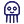
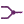
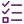

# Control Flow

*Deciding what happens next, how often, and when to stop.*

Once a pipeline can loop, it needs somewhere to make decisions. These components
route signals: hold them, gate them, split them, merge them, count them, and cap
what the whole thing is allowed to spend.

They are ordinary flow control — the kind of thing any program has — but drawn on
the canvas. If you have wired a repair loop and it is going round for ever, the fix
is somewhere in this section.

!!! warning "Nothing else bounds an unattended run"

    An agentic loop can call a model indefinitely, and every pass costs money. While
    you are sitting there watching, that is self-limiting. With a [trigger](triggers.md)
    armed it is not.

    **Budget Guard** is the component that makes this safe: it caps total spend and
    refuses the round that would exceed it. Put one between the Conversation Log and the
    LLM Call on any pipeline that can start itself.

    **Spend Ledger** and **Run Ledger** record what has actually been spent, so the cap
    is set against real numbers.

!!! tip "Gate or hold?"

    The two look similar and mean opposite things:

    - **Signal Gate** — *no*. Signals pass while Open is true; otherwise they leave by
      Blocked and take a different path.
    - **Hold Signal** — *not yet*. The signal waits until Release becomes true, then
      carries on as normal.

    Reach for the gate when there is an alternative path, and the hold when the work
    simply has to wait for something.

## Components

### Budget Guard

{ .phy-icon align=left }

Caps what this pipeline may spend and refuses the round that would go past it. Put one between a Conversation Log and an LLM Call on any pipeline with a trigger armed — nothing else bounds an unattended session.

<small>*Icon not yet assigned — showing the placeholder.*</small>

### Signal Gate

{ .phy-icon align=left }

Lets signals through while Open is true and sends them out of Blocked when it is false. For \"only carry on if…\" — use Hold Signal instead when the answer is \"not yet\" rather than \"no\".

<small>*Icon not yet assigned — showing the placeholder.*</small>

### Hold Signal

{ .phy-icon align=left }

Keeps a signal waiting until Release becomes true, then sends it on. Use Signal Gate instead when the answer is \"no\" rather than \"not yet\".

<small>*Icon not yet assigned — showing the placeholder.*</small>

### Signal Switch

{ .phy-icon align=left }

Sends a signal one way if its text contains the pattern and the other way if it does not. For the model's own intentions use a Declare node instead — a declared route cannot be found inside a sentence that meant the opposite.

<small>*Icon not yet assigned — showing the placeholder.*</small>

### Signal Limiter

{ .phy-icon align=left }

Counts signals and splits them at a limit: the first few leave one way, everything after leaves the other. This is how you cap the number of times a repair loop may go round.

### Signal Throttle

{ .phy-icon align=left }

Lets one signal through per interval and holds the newest of the rest until the interval is up. Put it where several triggers meet, so the rate is stated once for the whole pipeline.

<small>*Icon not yet assigned — showing the placeholder.*</small>

### Merge Signal

{ .phy-icon align=left }

Joins two or more branches into one signal. It waits for every wired input to be holding something, then sends one signal carrying all of it. Zoom in to add or remove inputs.

### For Each

{ .phy-icon align=left }

Sends one signal per item in a list, waiting for each round to finish before the next. Wire the end of the per-item work back into Next, and Done Signal to whatever happens after the list.

<small>*Icon not yet assigned — showing the placeholder.*</small>

### Feedback

{ .phy-icon align=left }

Sends signals across the canvas without a wire. Drag its grip onto a Feedback Collector and whatever arrives here comes out there — so a loop can close back to the Conversation Log without a line drawn across the whole definition.

### Feedback Collector

{ .phy-icon align=left }

The far end of the wireless Feedback links. It gathers everything sent to it and puts it back into the pipeline as one signal.

### Build Plan

{ .phy-icon align=left }

Follows a build that happens in stages. It reads the plan out of each reply and writes back where the build has got to — what is done, what was just placed, what is still to come. It only watches: the reply passes through exactly as it arrived.

