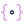
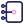
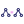

# Guardrails

*Checking the model's work before it reaches your file.*

Models produce confident, plausible, wrong answers. Guardrails are the components
that check the work: is this valid JSON, do these components exist, did everything
actually get placed, did any of it turn red once it ran?

Each one either passes the work along or sends it back to the model with a
description of what went wrong. That return path is the important half — a failed
check is not an error message for you, it is another turn in the conversation, and
models are generally good at fixing a fault they have been shown.

**Stall Guard** is the component that stops this being an infinite loop.

!!! info "Structured output, and why it needs validating"

    Physalia asks the model to describe a Grasshopper definition as JSON. Asking nicely
    gets valid JSON most of the time — but "most of the time" is not a foundation you
    can build a definition on, so the shape is stated as a **schema** and every reply is
    checked against it before anything is placed.

    Some providers can enforce a schema during generation, which helps a great deal but
    does not remove the need to check: a reply can be perfectly valid JSON and still
    reference a component that does not exist on your machine.
    [Structured outputs](https://platform.openai.com/docs/guides/structured-outputs)
    covers the guarantees such modes do and do not give you.

!!! info "Evaluator loops"

    The pattern here has a name: one model produces work, something else evaluates it,
    and the criticism feeds back for another attempt. The evaluator can be another model,
    but it is far better when it can be a deterministic check — a schema, a component
    lookup, a runtime error list. Those never hallucinate and cost nothing.

    Most of these components are that kind of check. **Runtime Health Check** is the
    strongest of them: it reads what the placed components actually did, which is the
    only evidence that cannot be argued with.

    [Building effective agents](https://www.anthropic.com/engineering/building-effective-agents)
    describes this as the evaluator–optimizer workflow.

!!! warning "Repair loops must be bounded"

    A model that cannot fix a fault will happily try the same fix for ever, and each
    attempt costs a call. **Stall Guard** watches for the same failure recurring and
    stops the loop; **Signal Limiter** caps attempts by count; **Budget Guard** caps
    them by money. On any pipeline with a [trigger](triggers.md) armed, at least one of
    these is not optional.

## Components

### Detect JSON

{ .phy-icon align=left }

Separates answers that are trying to be JSON from ordinary conversation. Any attempt passes on, even a broken one; plain talk stops here in silence, so chatting to the model never sets the validation loop going.

### Schema Validator

{ .phy-icon align=left }

Finds the JSON in the model's reply, ignoring any chatter around it, and checks it against the schema. Valid JSON carries on; invalid JSON goes back to the model with the reason.

### GH Definition Validator

{ .phy-icon align=left }

Checks a generated definition holds together before anything is placed: ids used once, connections pointing at components that exist, groups naming real members. Works on a whole definition or an edit to one.

### Required Input Check

{ .phy-icon align=left }

Catches the wiring mistakes that can be seen before anything is placed: a required input with nothing in it, several wires into an input that takes one thing, a connection pointing past the end of a component, a slider driving nothing.

### Component Resolver

{ .phy-icon align=left }

Matches the component names in a generated definition to components actually installed here and stamps in their type ids. A name matching nothing goes back to the model rather than failing on the canvas.

### Fidelity Check

{ .phy-icon align=left }

Compares the canvas against the definition that produced it — every component landed, every connection made. It catches the gap between what the model asked for and what actually appeared. Whole definitions only; an edit to an existing one passes straight through.

### Runtime Health Check

{ .phy-icon align=left }

Reads the placed components after they have run: red errors, orange warnings, components sitting there producing nothing. This is where a definition that looked right on paper admits what it actually did. Right-click to stop treating warnings as failures.

### Geometry Report

{ .phy-icon align=left }

Measures what was built and writes it out in words: how big each thing is, where it sits, how many there are, what stands apart from what, what is inside what. The same feedback a photograph gives, for a model that cannot see.

### Geometry Observation

{ .phy-icon align=left }

Frames the Rhino viewport on the geometry that was just built and photographs it, so the model can look at the result instead of being told about it. Needs a model that accepts images.

### Stall Guard

{ .phy-icon align=left }

Stops a repair loop going round for ever. It watches for the same failure arriving again and again: at the limit the model is told to stop patching and explain the problem to you, and beyond it nothing more is sent. Any different failure starts the count over.

