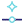

# Models

*Which model answers, where it runs, and how it is tuned.*

A Model component names the model that will answer and hands the LLM Call whatever
it needs to reach it. Swapping providers is a matter of swapping this one component
— the rest of your definition does not change.

Physalia talks to hosted providers over their APIs, to anything that speaks the
OpenAI protocol (which is most things, including local servers), and to coding CLIs
already signed in on your machine. **Tweakers** are optional: attach one to adjust
how a model writes, and leave it off to accept the provider's defaults.

!!! info "Temperature, and why answers vary"

    A model does not pick the single most likely next word; it samples from a
    distribution of candidates. **Temperature** controls how adventurous that sampling
    is. Low temperature gives repeatable, conservative text — usually what you want for
    code and JSON. Higher temperature gives more variety, and more mistakes.

    This is why the same prompt can give different answers twice in a row. The
    [Messages API reference](https://docs.claude.com/en/api/messages) documents these
    sampling parameters and their ranges.

!!! info "Reasoning, or “thinking” models"

    Some models can be told to work through a problem at length before committing to an
    answer. The scratch work costs tokens and time, and usually buys accuracy on
    problems with several steps — which is most geometry work.

    The Tweaker components expose this as a budget. Anthropic's
    [Extended thinking](https://docs.claude.com/en/docs/build-with-claude/extended-thinking)
    explains the trade-off; the same idea appears under different names across providers.

!!! tip "Running a model locally costs nothing per token"

    **OpenAI Compatible Model** pointed at [Ollama](https://ollama.com) or a
    `llama.cpp` server runs entirely on your machine: no key, no account, no data
    leaving the building. Local models are weaker than frontier hosted ones, but for
    iterating on a harness — where you will run the same loop fifty times — that
    matters less than it sounds.

    **Claude Code Model** and **Codex Model** are a middle road: they reuse a CLI you
    have already signed into, so there is no separate API key to manage.

## Components

### Model API

{ .phy-icon align=left }

Hands one provider's endpoint and key to a Model component. Set providers up in the chat window; the key itself never appears on the canvas and is never written into your .gh file.

### Anthropic Model

{ .phy-icon align=left }

Points the pipeline at an Anthropic model. The list of models on offer is fetched from the API as soon as a key arrives.

### OpenAI Compatible Model

{ .phy-icon align=left }

Points the pipeline at anything that speaks the OpenAI API — OpenAI itself, OpenRouter, DeepSeek, Groq, Ollama, a local llama.cpp server. Changing the endpoint is a matter of changing the URL.

### Gemini Model

{ .phy-icon align=left }

Points the pipeline at a Google Gemini model. The list of models on offer is fetched from the API as soon as a key arrives.

### Claude Code Model

{ .phy-icon align=left }

Runs inference through the Claude Code CLI already installed on this machine, signed in as you are. No key to store, nothing billed per token.

### Codex Model

{ .phy-icon align=left }

Runs inference through the OpenAI Codex CLI already installed on this machine, signed in as you are. No key to store, nothing billed per token.

### Model Information

{ .phy-icon align=left }

Looks a model up in the public OpenRouter and LiteLLM catalogues and reports what it can do — so a compaction budget can be set against real numbers instead of a guess.

### LlamaCpp Model Info

{ .phy-icon align=left }

Asks a running llama-server how much context it was started with, and guesses the rest from the public catalogues by tidying up the GGUF model name.

### Anthropic Tweaker

{ .phy-icon align=left }

Changes how an Anthropic model picks its words, and how much it is allowed to think before answering.

### OpenAI Compatible Tweaker

{ .phy-icon align=left }

Changes how an OpenAI-compatible model picks its words, how long a reply may run, and how hard a reasoning model thinks.

### Gemini Tweaker

{ .phy-icon align=left }

Changes how a Gemini model picks its words, and how much it is allowed to think before answering.

